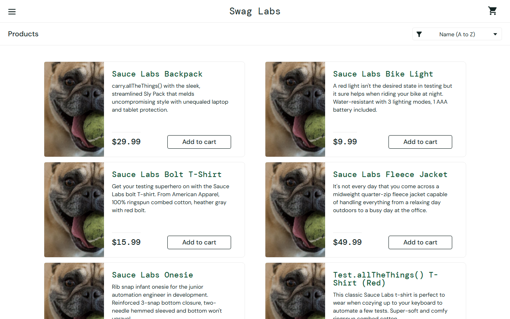
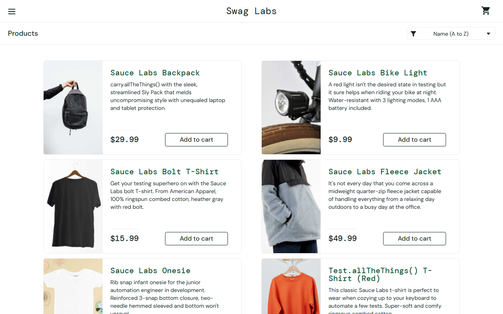

# BUG-001: All product images show the same wrong picture

| Field | Value |
|---|---|
| **ID** | BUG-001 |
| **Module** | Products |
| **Severity** | Medium |
| **Priority** | High |
| **Affected user** | problem_user |
| **Environment** | Chrome (latest) / Windows 11, 1280×800 |
| **URL** | https://www.saucedemo.com |
| **Reported** | 28 Sep 2026 · Deniz Akyol |
| **Status** | Open |

## Preconditions

Logged in as `problem_user`

## Steps to reproduce

1. Log in as `problem_user` / `secret_sauce`
2. Look at the product images on the Products page

## Expected result

Each product shows its own image (backpack, bike light, t-shirt, ...), like for `standard_user`.

## Actual result

All 6 products show the same dog picture (`sl-404.jpg`). `visual_user` has the same problem for Sauce Labs Backpack only.

## Evidence

Reference (`standard_user`):

## Notes

The image file name `sl-404` suggests a missing image fallback. Users cannot see what they buy.
