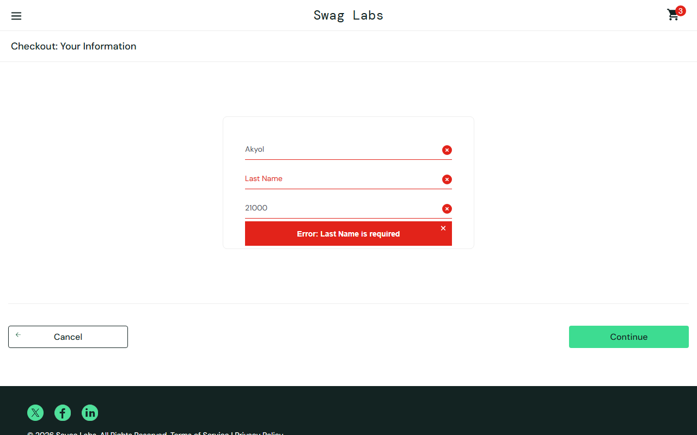

# BUG-002: Typing in Last Name changes First Name, checkout is blocked

| Field | Value |
|---|---|
| **ID** | BUG-002 |
| **Module** | Checkout |
| **Severity** | Critical |
| **Priority** | High |
| **Affected user** | problem_user |
| **Environment** | Chrome (latest) / Windows 11, 1280×800 |
| **URL** | https://www.saucedemo.com |
| **Reported** | 28 Sep 2026 · Deniz Akyol |
| **Status** | Open |

## Preconditions

Logged in as `problem_user`, at least one product in the cart

## Steps to reproduce

1. Open the cart and click **Checkout**
2. Enter First Name `Deniz`
3. Enter Last Name `Akyol`
4. Enter Postal Code `21000`
5. Click **Continue**

## Expected result

Fields contain `Deniz`, `Akyol`, `21000` and the overview page opens.

## Actual result

The text typed in Last Name goes into First Name (First Name = `Akyol`) and Last Name stays empty. Error "Last Name is required" is shown. The user cannot finish the order.

## Evidence

## Notes

No workaround found. The order flow is fully blocked for this user.
