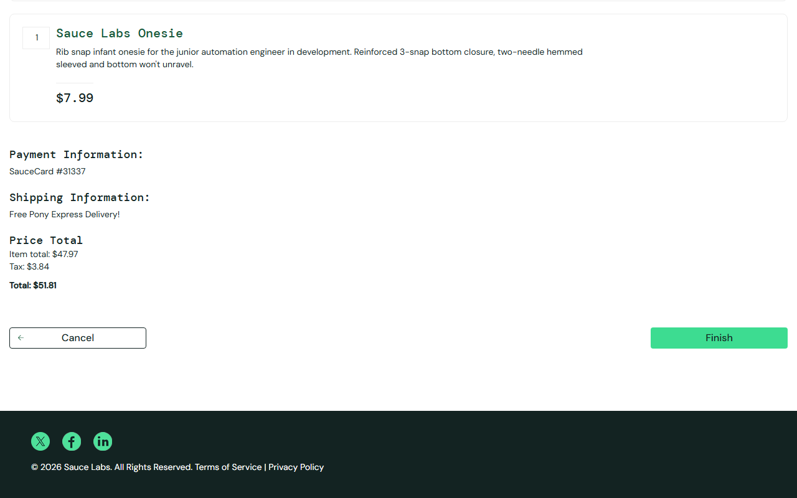

# BUG-005: Finish button does nothing, order cannot be completed

| Field | Value |
|---|---|
| **ID** | BUG-005 |
| **Module** | Checkout |
| **Severity** | Critical |
| **Priority** | High |
| **Affected user** | error_user |
| **Environment** | Chrome (latest) / Windows 11, 1280×800 |
| **URL** | https://www.saucedemo.com |
| **Reported** | 28 Sep 2026 · Deniz Akyol |
| **Status** | Open |

## Preconditions

Logged in as `error_user`, one product in the cart

## Steps to reproduce

1. Cart → **Checkout**
2. Fill the form with valid data and click **Continue**
3. On the overview page click **Finish**

## Expected result

"Thank you for your order!" page opens.

## Actual result

Nothing happens. The user stays on `checkout-step-two.html`. No error message is shown.

## Evidence

## Notes

The main business flow is blocked and the user gets no feedback.
