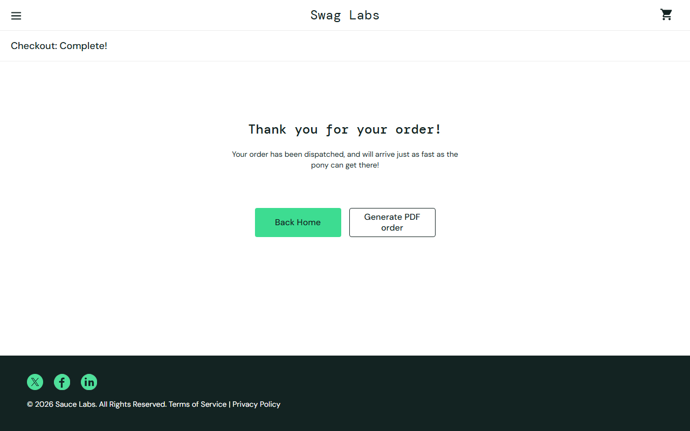

# BUG-009: Order can be completed with an empty cart

| Field | Value |
|---|---|
| **ID** | BUG-009 |
| **Module** | Cart / Checkout |
| **Severity** | High |
| **Priority** | High |
| **Affected user** | standard_user |
| **Environment** | Chrome (latest) / Windows 11, 1280×800 |
| **URL** | https://www.saucedemo.com |
| **Reported** | 28 Sep 2026 · Deniz Akyol |
| **Status** | Open |

## Preconditions

Logged in as `standard_user`, cart is empty

## Steps to reproduce

1. Open the cart (no products)
2. Click **Checkout**
3. Fill the form with valid data, click **Continue**
4. Click **Finish**

## Expected result

Checkout button is disabled or a message says the cart is empty. No order is created.

## Actual result

All steps work and "Thank you for your order!" is shown for an order with 0 items.

## Evidence

## Notes

Found with `standard_user`, so it affects every user. Empty orders can reach the order system.
