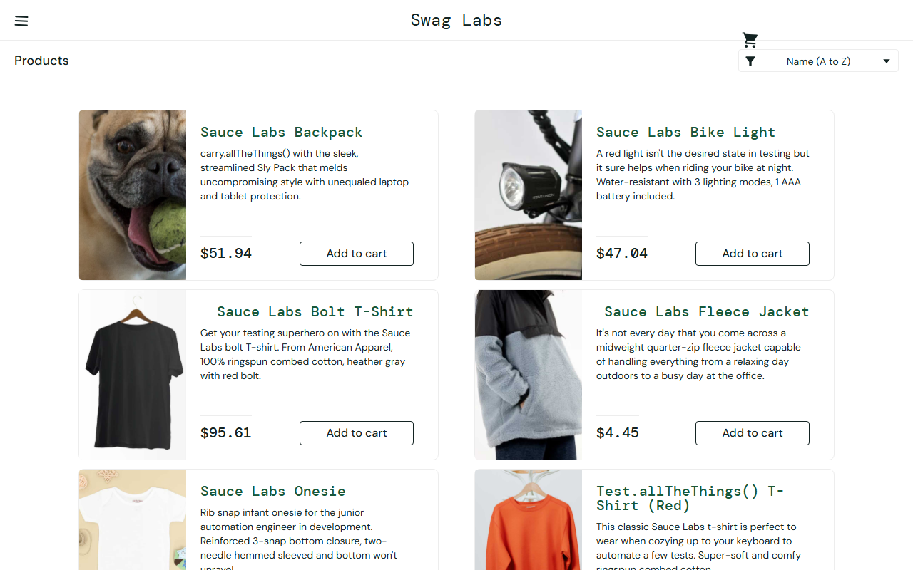

# BUG-012: Wrong product prices and broken layout for visual_user

| Field | Value |
|---|---|
| **ID** | BUG-012 |
| **Module** | Products |
| **Severity** | High |
| **Priority** | High |
| **Affected user** | visual_user |
| **Environment** | Chrome (latest) / Windows 11, 1280×800 |
| **URL** | https://www.saucedemo.com |
| **Reported** | 28 Sep 2026 · Deniz Akyol |
| **Status** | Open |

## Preconditions

Logged in as `visual_user`

## Steps to reproduce

1. Look at the product prices and the page layout
2. Log out, log in again and compare the prices
3. Compare with the Products page of `standard_user`

## Expected result

Same prices and layout as for `standard_user` (e.g. Backpack $29.99, Fleece Jacket $49.99).

## Actual result

Prices are different and change on every login (e.g. Backpack $51.94, Fleece Jacket $4.45). The cart icon is moved below the header, some product names are not aligned, and the Backpack shows the wrong image.

## Evidence

Reference (`standard_user`):

## Notes

Wrong prices are a business risk: the user sees a price that is not the real price.
